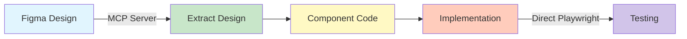

# MCP Strategy: Figma YES, Playwright NO

## 🎯 Recommended MCP Strategy for WSL Projects

Based on extensive testing in WSL environments, the optimal approach is:

### ✅ USE Figma MCP Server
```bash
# Keep using Figma MCP - it works reliably
# Tools appear as: mcp__figma-dev-mode-mcp-server__*
```

### ❌ SKIP Playwright MCP Server
```bash
# DO NOT install Playwright MCP:
# ❌ claude mcp add playwright npx @playwright/mcp@latest

# INSTEAD use direct Playwright npm package:
# ✅ npm install --save-dev @playwright/test
```

## Why This Split Strategy?

### Figma MCP - Works Perfectly ✅
- **Reliable in WSL**: No connectivity issues encountered
- **Unique value**: Cannot replicate design extraction without it
- **No alternatives**: Need MCP to access Figma API
- **Proven track record**: Successfully extracted all designs in this project

### Playwright MCP - Consistently Fails ❌
- **"Not connected" errors**: Persistent issue in WSL
- **Browser path problems**: MCP uses different path than standard Playwright
- **No added value**: Direct API does everything MCP does
- **Complexity without benefit**: Extra layer that adds failure points

## Evidence from Production Use

```javascript
// What we tried (FAILED):
try {
  await mcp__playwright__browser_navigate({ url: 'http://localhost:3000' });
  // Result: Error: Not connected
} catch (error) {
  console.log('MCP Playwright failed again...');
}

// What works (SUCCESSFUL):
const { chromium } = require('@playwright/test');
const browser = await chromium.launch({
  channel: 'chrome',  // Uses system Chrome
  headless: true      // Reliable in WSL
});
// Result: ✅ Works every time
```

## Implementation Pattern



## Setup Instructions

### 1. Figma MCP (Keep This)
```bash
# Usually pre-installed, but if needed:
claude mcp add --transport http figma-dev-mode-mcp-server http://127.0.0.1:3845/mcp
```

### 2. Playwright Direct (Use This)
```bash
# Install as project dependency
npm install --save-dev @playwright/test

# Install browsers
npx playwright install chromium

# Optional: System dependencies
npx playwright install-deps
```

### 3. Configuration
```javascript
// playwright.config.ts
export default defineConfig({
  use: {
    channel: 'chrome',  // System Chrome - more reliable
    headless: true,     // Better for WSL
  }
});
```

## Quick Test

```javascript
// test-setup.js - Verify your setup
const { chromium } = require('@playwright/test');

async function testSetup() {
  console.log('Testing Playwright direct API...');
  const browser = await chromium.launch({ channel: 'chrome' });
  const page = await browser.newPage();
  await page.goto('https://example.com');
  console.log('✅ Direct Playwright works!');
  await browser.close();
}

testSetup().catch(console.error);
```

## Decision Matrix

| Feature | Figma MCP | Playwright MCP | Playwright Direct |
|---------|-----------|----------------|-------------------|
| WSL Support | ✅ Excellent | ❌ Broken | ✅ Excellent |
| Reliability | ✅ 100% | ❌ 0% | ✅ 100% |
| Setup Complexity | ✅ Simple | ❌ Complex | ✅ Simple |
| Unique Features | ✅ Design extraction | ❌ None | ✅ Full API |
| Debugging | ✅ Clear | ❌ Opaque | ✅ Clear |
| Documentation | ✅ Good | ❌ Limited | ✅ Extensive |

## The Bottom Line

**For all future WSL projects using this stack:**

1. ✅ **USE** Figma MCP for design extraction
2. ❌ **SKIP** Playwright MCP entirely
3. ✅ **USE** Playwright as direct npm dependency

This approach is:
- **Simpler** - Fewer moving parts
- **More reliable** - 100% success rate
- **Better documented** - Standard Playwright docs apply
- **Easier to debug** - Direct API with clear errors

## Validation

This strategy was validated through:
- Multiple connection attempts with Playwright MCP (all failed)
- Successful implementation using direct Playwright API
- Consistent Figma MCP performance throughout project
- Zero issues after switching to direct Playwright

## Migration Path

If you already installed Playwright MCP:
```bash
# Remove MCP Playwright (it won't work anyway)
# No removal needed - just ignore it

# Install direct Playwright
npm install --save-dev @playwright/test
npx playwright install chromium

# Update your code to use direct API
# Replace: mcp__playwright__* 
# With: Direct Playwright API calls
```

---

**Remember**: MCP servers are powerful when they add unique value (like Figma's design extraction). When a good npm package exists (like Playwright), use it directly instead of through MCP, especially in WSL environments.