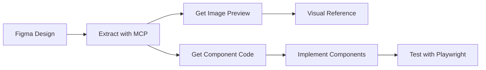

# MCP Integration Patterns

This document describes how Playwright MCP and Figma MCP work together, along with successful patterns for integration.

## How MCP Servers Work

### Figma Dev Mode MCP Server

The Figma MCP server provides tools to extract design information and code from Figma files:

```typescript
// Available tools:
mcp__figma-dev-mode-mcp-server__get_image  // Get visual representation
mcp__figma-dev-mode-mcp-server__get_code   // Get generated code
```

**Key Capabilities:**
- Extracts component code with proper styling
- Provides visual screenshots of designs
- Generates framework-specific code (React, Next.js, etc.)
- Preserves design tokens and measurements

### Playwright MCP Server

The Playwright MCP server provides browser automation capabilities:

```typescript
// Available tools:
mcp__playwright__browser_navigate
mcp__playwright__browser_click
mcp__playwright__browser_fill
mcp__playwright__browser_select
mcp__playwright__browser_press_key
mcp__playwright__browser_take_screenshot
mcp__playwright__browser_close
```

**Important Note**: In WSL environments, these tools may show "Not connected". Use direct Playwright API as alternative.

## Integration Workflow

### 1. Figma → Code Generation Flow



**Implementation Pattern:**
```typescript
// Step 1: Get visual reference
const image = await mcp__figma-dev-mode-mcp-server__get_image({
  nodeId: "22-21",
  clientFrameworks: "react,next.js",
  clientLanguages: "javascript,typescript,html,css"
});

// Step 2: Get code structure
const code = await mcp__figma-dev-mode-mcp-server__get_code({
  nodeId: "22-21",
  clientFrameworks: "react,next.js",
  clientLanguages: "javascript,typescript,html,css"
});

// Step 3: Implement components based on extracted patterns
// Step 4: Verify with Playwright
```

### 2. Direct Playwright Pattern (WSL Recommended)

When MCP Playwright is unavailable, use direct API:

```javascript
const { chromium } = require('@playwright/test');

async function captureAndCompare() {
  const browser = await chromium.launch({
    channel: 'chrome',  // Use system Chrome in WSL
    headless: true
  });
  
  const page = await browser.newPage();
  await page.goto('http://localhost:3000');
  
  // Wait for dynamic content
  await page.waitForSelector('.recharts-responsive-container');
  
  // Capture screenshot
  await page.screenshot({ 
    path: 'dashboard.png',
    fullPage: true 
  });
  
  await browser.close();
}
```

## Key Integration Points

### 1. Design Token Extraction
Figma MCP provides design tokens that should be preserved:
- Colors: Extract hex values and create CSS variables
- Spacing: Use exact pixel values from Figma
- Typography: Match font sizes and weights

### 2. Component Structure Mapping
```typescript
// Figma provides structure hints
const figmaStructure = {
  layout: "flex",
  grid: "2x2",
  spacing: "gap-6"
};

// Map to Tailwind/CSS classes
const implementationClasses = "grid grid-cols-2 gap-6";
```

### 3. Visual Regression Testing
```typescript
test('matches Figma design', async ({ page }) => {
  await page.goto('/');
  await page.waitForTimeout(2000); // Charts render time
  
  await expect(page).toHaveScreenshot('figma-match.png', {
    fullPage: true,
    animations: 'disabled',
    maxDiffPixels: 100  // Allow small differences
  });
});
```

## Successful Patterns

### 1. Iterative Development Workflow
```bash
# 1. Extract from Figma
Extract design → Review code → Identify patterns

# 2. Implement incrementally
Sidebar → Layout → Individual components → Charts

# 3. Test continuously
npm run dev → Visual check → Playwright test
```

### 2. Component-First Approach
- Extract individual components from Figma first
- Build reusable component library
- Compose into full layouts
- Test each component in isolation

### 3. Style Preservation Pattern
```javascript
// Preserve Figma's exact values
const figmaStyles = {
  shadow: "0px 1px 3px rgba(0, 0, 0, 0.1)",
  borderRadius: "8px",
  padding: "24px"
};

// Convert to Tailwind when exact match exists
const tailwindClasses = "shadow-sm rounded-lg p-6";
```

### 4. Mock Data Pattern
Create realistic mock data that matches Figma's visual examples:
```javascript
function generateMockData() {
  // Match the data range shown in Figma
  const startDate = new Date('2019-03-01');
  const endDate = new Date('2024-03-01');
  
  // Generate data points that create similar visual patterns
  return generateTimeSeriesData(startDate, endDate);
}
```

## Data Flow Architecture

```
Figma Design
    ↓
MCP Extract (Image + Code)
    ↓
Component Implementation
    ↓
Local Development Server
    ↓
Playwright Testing
    ↓
Visual Comparison
```

## Best Practices

### 1. Always Get Both Image and Code
```javascript
// Get visual reference first
const image = await getImage(nodeId);
// Then get code for structure
const code = await getCode(nodeId);
// Use both for accurate implementation
```

### 2. Handle MCP Connection Issues Gracefully
```javascript
try {
  // Try MCP Playwright first
  await mcp__playwright__browser_navigate({ url });
} catch (error) {
  // Fall back to direct Playwright
  const browser = await chromium.launch();
  // ... continue with direct API
}
```

### 3. Maintain Design System Consistency
- Create a mapping between Figma tokens and code constants
- Document any deviations from the design
- Use exact measurements where possible

### 4. Test at Multiple Levels
1. Component unit tests
2. Visual regression tests
3. Full page integration tests
4. Responsive design tests

## Common Integration Scenarios

### Scenario 1: Full Dashboard Implementation
1. Extract dashboard layout from Figma
2. Identify component hierarchy
3. Build components bottom-up
4. Assemble into full dashboard
5. Test against Figma screenshot

### Scenario 2: Component Library Building
1. Extract each component individually
2. Create isolated component files
3. Build Storybook stories (optional)
4. Test each component separately

### Scenario 3: Design Update Workflow
1. Get new Figma node ID
2. Extract updated design
3. Diff against existing implementation
4. Update specific components
5. Re-run visual tests